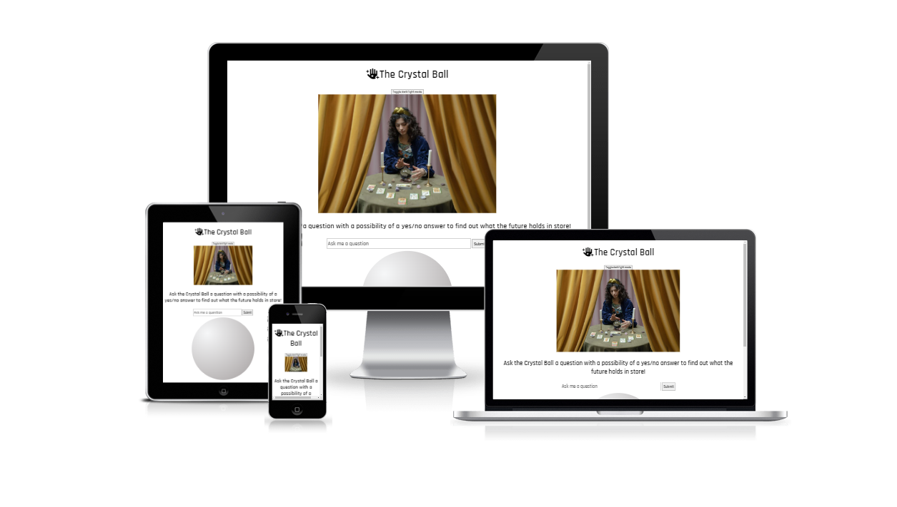
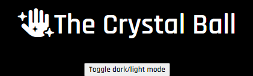
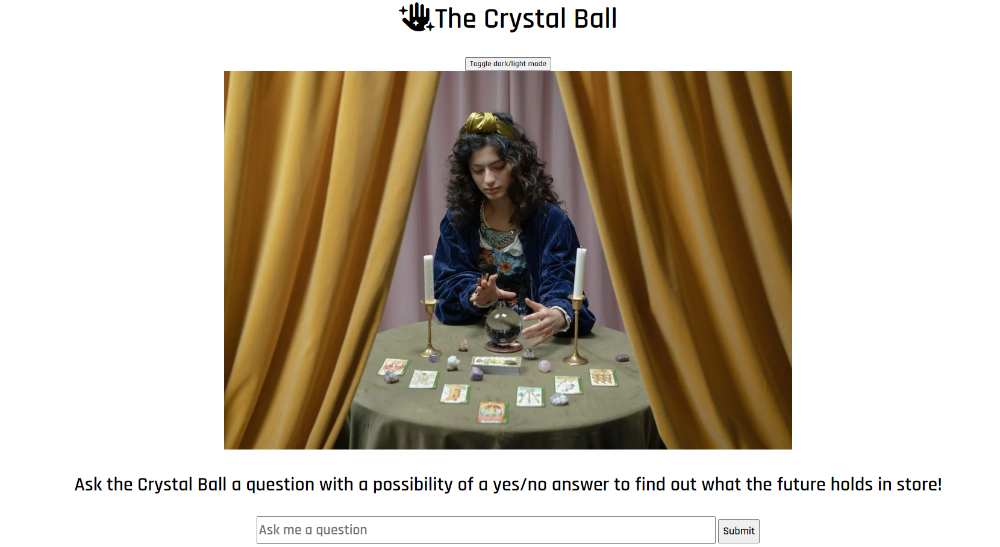
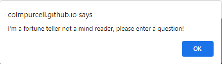
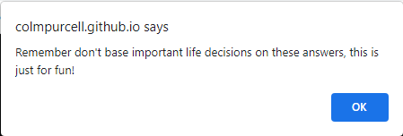
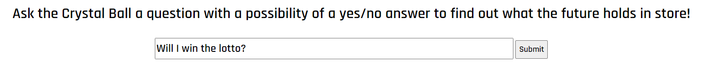
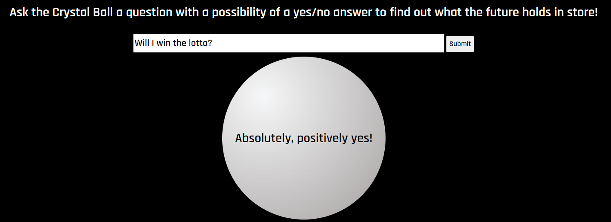
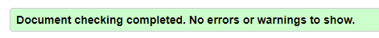
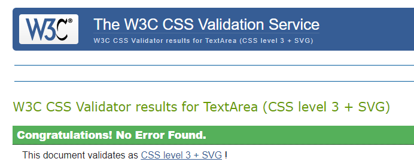
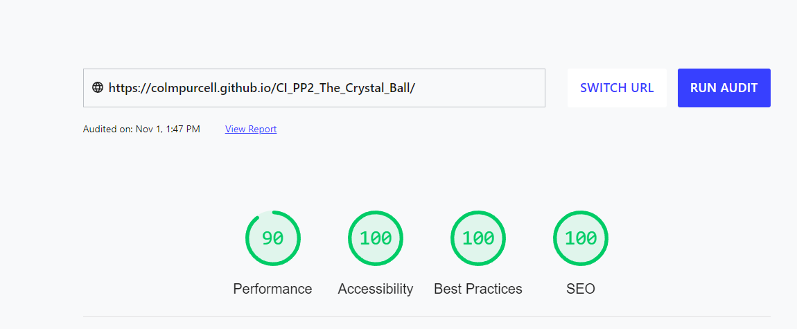

# The Crystal Ball

The Crystal Ball is a fun website where users can enter a question with the possibility of a yes/no answer and get a prediction from the crystal ball.
The target audience is anyone looking for a fun game to predict the future.

The deployed live website can be found [here](https://colmpurcell.github.io/CI_PP2_The_Crystal_Ball/)

## Table of Content

1. [UX](#ux)
    1. [Site Goal](#site-goal)
    2. [Existing User Goals](#existing-user-goals)
    3. [New User Goals](#new-user-goals)
2. [Design](#design)
    1. [Color Scheme](#color-scheme)
    2. [Typography](#typography)
    3. [Images](#images)
3. [Features](#features)
4. [Testing](#testing)
    1. [Validator Testing](#validator-testing)
    2. [Lighthouse audit](#lighthouse-audit)
    3. [Bugs & Fixes](#bugs-and-fixes)
5. [Technologies Used](#technologies-used)
    1. [Main Languages Used](#main-languages-used)
    2. [Libraries, Frameworks and Programmes](#libraries-frameworks-and-programmes)
6. [Deployment](#deployment)
7. [Media](#media)
8. [Credits](#credits)
9. [Acknowledgements](#acknowledgements)

## UX

### Site Goal:

To provide a fun game for people looking to get a prediction on a question submitted with the possibility of a yes/no answer.
To provide a clear layout with intuitive user controls and clear user feedback.

### Existing User Goals:

- As an existing user: I want to be able to find get predictions to multiple questions with different responses each time.

### New User Goals:

- As a new user: I want to be able to find a fun game to predict the outcome of a future event.

## Design

### Color Scheme
The color scheme chosen is a simple black and white, with the ability to toggle between dark and light modes for the body and fonts to make the site easily readable.
A radial gradient containing shades of grey was chosen for the circular answer div to give the impression of a crystal ball with the text appearing in black.

### Typography

The Google font [Rajdhani](https://fonts.google.com/specimen/Rajdhani?query=Rajdhani) was chosen for the site with a fallback of Sans-Serif.
The unusual look of the font adds an element of mysteriousness while also having a clean appearance and high readability.

### Images:

The image was taken from the free images website [Plexels.com](https://www.pexels.com/) and will be credited in the credits section.

## Features

### Button to toggle between dark and light modes

The toggle button allows the user to toggle between dark and light modes for the site.

Dark mode

Light mode

### Alert when no question is entered

A funny alert message to remind users to enter a question.

### Alert when question is entered

A funny alert to remind users not to take the prediction too seriously.

### Question section 

Area for users to submit their questions.

### Answer section

Prediction for user displayed on a crystal ball.

## Testing

### Validator testing

The code validation was tested using [W3C validator](https://validator.w3.org/) for html and it passed with no issues found.

The code validation was tested using [Jigsaw validator](https://jigsaw.w3.org/css-validator/) for css with no issues found.

The code validation was tested using [jshint](https://jshint.com/) for JavaScript with no issues found.

### Lighthouse Audit:

A performance audit was carried out using [web.dev/measure](https://web.dev/measure/) and the site scores high across all areas with scores of 100 for Accessibility, Best Practices and SEO.

The site was tested using Chrome, Safari & Edge browsers with no issues.
The site was tested on a range of devices including iPhone 11 and 13, Samsung Galaxy S10 and A70 and Lenovo Smart Tab M10 plus with no issues found.

### Bugs and fixes:

1. Expected: Answer would only be given if question is asked.
 - Testing: Clicked submit without inputting a question.
 - Result: Answer was given without a question being submitted.
 - Fix: Adjusted the function to give an alert for no question prompting the user to enter a question.
2. Expected: The question field would clear once a question was asked.
 - Testing: Entered a question and clicked submit.
 - Result: Question field didn't clear.
 - Fix: Enter 1 line of code to clear the answer field when the function runs.
3. Expected: Code validation would pass with no issues found.
 - Testing: The code validation was tested using [jshint](https://jshint.com/).
 - Result: One warning was showing for using "let" in my function.
 - Fix: I replaced let with var which didn't impact my function and allowed validation to pass.

## Technologies Used

### Main Languages Used:

- HTML5
- CSS3
- JavaScript

### Libraries, Frameworks and Programmes:
- Font Awesome: Used for favicon for site and icon used in the heading.
- Google Fonts: Used to import the font Rajdhani. A back up of sans-serif was used also.
- Github: Used to store my repository and deploy my page.
- Gitpod: Used to edit my code and push code to github.

## Deployment:

Gitpod was used as the development environment, where regular commits and pushes to github were made and tracked.
The live version of the project site is deployed using Github pages and can be found [here](https://colmpurcell.github.io/CI_PP2_The_Crystal_Ball/).

The steps for deployment are as follows:
- Log into Github.
- Locate the GitHub Repository to be deployed live.
- At the top of the repository, select Settings from the menu items.
- In the "Code and automation" section of the sidebar, click Pages.
- At the ”Source” section choose ”main” as Branch and root as folder and click ”Save”
- The website will be deployed and the page will refresh to provide the live link to the page.

## Media

The main image was taken from [pexels.com](https://www.pexels.com/)
-[A woman fortune telling](https://www.pexels.com/photo/a-woman-fortune-telling-7179426/) by cottonbro

## Credits

A guide to creating sphere shaped elements was used to create the crystal ball div from [https://cssanimation.rocks/](https://cssanimation.rocks/spheres/)

A guide to creating a toggle button to switch between dark/light mode was used from [https://www.w3schools.com](https://www.w3schools.com/howto/howto_js_toggle_dark_mode.asp)

## Acknowledgements

- Seán for giving great feedback and spotting issues.
- My wife Annelise for all the great feedback, advice and support.